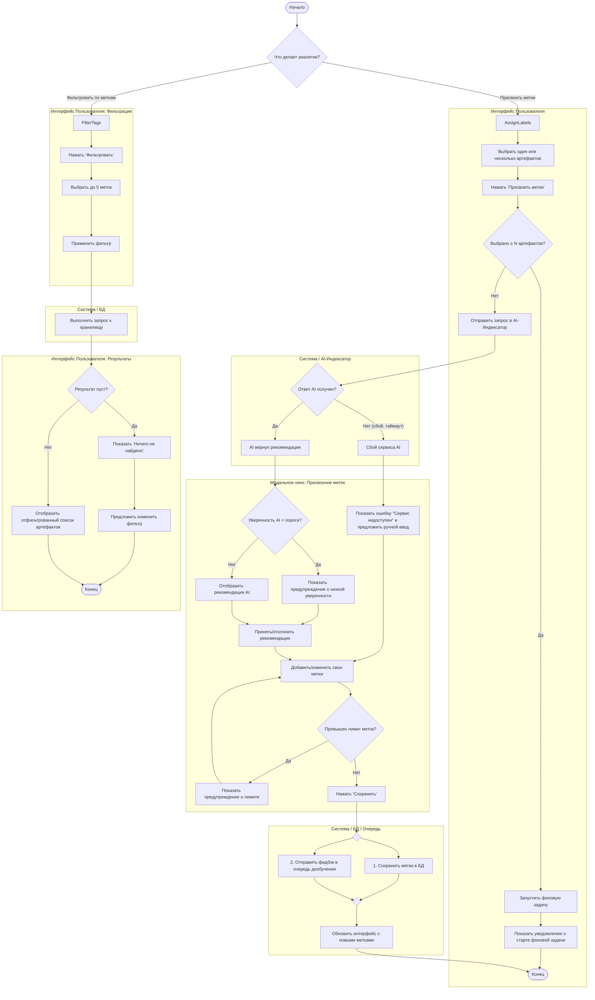

```mermaid
flowchart TD
    Start([Начало])
    Start --> DecisionAction{Что делает аналитик?}
    DecisionAction --> |Присвоить метки| AssignLabels
    DecisionAction --> |Фильтровать по меткам| FilterTags

    subgraph UI_Main [Интерфейс Пользователя]
      AssignLabels --> SelectArtifacts[Выбрать один или несколько артефактов]
      SelectArtifacts --> ClickAssign["Нажать ‘Присвоить метки’"]
      ClickAssign --> DecisionBulk{Выбрано ≥ N артефактов?}
      DecisionBulk --> |Да| StartBackground[Запустить фоновую задачу]
      StartBackground --> NotifyBG[Показать уведомление о старте фоновой задачи]
      NotifyBG --> EndFlow1([Конец])
      DecisionBulk --> |Нет| CallAI
    end

    subgraph System_AI [Система / AI-Индексатор]
      CallAI[Отправить запрос в AI-Индексатор] --> DecisionAI{Ответ AI получен?}
      DecisionAI --> |"Нет (сбой, таймаут)"| AI_Fail[Сбой сервиса AI]
      DecisionAI --> |Да| AI_Success[AI вернул рекомендации]
    end

    subgraph UI_Modal [Модальное окно: Присвоение меток]
      AI_Fail --> ShowErrorAndManualInput["Показать ошибку &quot;Сервис недоступен&quot; и предложить ручной ввод"]
      AI_Success --> DecisionConf{Уверенность AI < порога?}
      DecisionConf --> |Да| WarnLowConf[Показать предупреждение о низкой уверенности]
      DecisionConf --> |Нет| ShowRecs[Отобразить рекомендации AI]

      ShowErrorAndManualInput --> AddCustomTags
      WarnLowConf --> ReviewAndAdd
      ShowRecs --> ReviewAndAdd

      ReviewAndAdd[Принять/отклонить рекомендации] --> AddCustomTags[Добавить/изменить свои метки]
      AddCustomTags --> DecisionLimit{Превышен лимит меток?}
      DecisionLimit --> |Да| WarnLimit[Показать предупреждение о лимите]
      WarnLimit --> AddCustomTags 
      DecisionLimit --> |Нет| ClickSave["Нажать ‘Сохранить’"]
    end

    subgraph System_Backend [Система / БД / Очередь]
      ClickSave --> Fork_Save{ }
      Fork_Save --> SaveTags[1. Сохранить метки в БД]
      Fork_Save --> EnqueueFeedback[2. Отправить фидбэк в очередь дообучения]
      SaveTags --> Join_Save{ }
      EnqueueFeedback --> Join_Save
      Join_Save --> UpdateUI[Обновить интерфейс с новыми метками]
      UpdateUI --> EndFlow1
    end

    subgraph UI_Filter_Panel [Интерфейс Пользователя: Фильтрация]
      FilterTags --> ClickFilter["Нажать ‘Фильтровать’"]
      ClickFilter --> SelectTags[Выбрать до 5 меток]
      SelectTags --> ApplyFilter[Применить фильтр]
    end

    subgraph System_DB [Система / БД]
      ApplyFilter --> QueryArtifacts[Выполнить запрос к хранилищу]
    end

    subgraph UI_Filter_Results [Интерфейс Пользователя: Результаты]
      QueryArtifacts --> DecisionEmpty{Результат пуст?}
      DecisionEmpty --> |Да| ShowNoResults[Показать ‘Ничего не найдено’]
      ShowNoResults --> SuggestChange[Предложить изменить фильтр]
      SuggestChange --> EndFlow2([Конец])
      DecisionEmpty --> |Нет| ShowResults[Отобразить отфильтрованный список артефактов]
      ShowResults --> EndFlow2
    end
```
