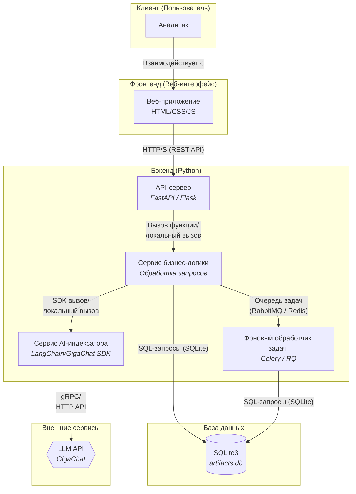

```mermaid
graph TD
    subgraph "Клиент (Пользователь)"
        A[Аналитик]
    end

    subgraph "Фронтенд (Веб-интерфейс)"
        B[Веб-приложение <br> HTML/CSS/JS]
    end

    subgraph "Бэкенд (Python)"
        C[API-сервер <br><i>FastAPI / Flask</i>]
        D[Сервис бизнес-логики <br><i>Обработка запросов</i>]
        E[Сервис AI-индексатора <br><i>LangChain/GigaChat SDK</i>]
        F[Фоновый обработчик задач <br><i>Celery / RQ</i>]
    end

    subgraph "База данных"
        G[(SQLite3 <br><i>artifacts.db</i>)]
    end
    
    subgraph "Внешние сервисы"
        H{{LLM API <br><i>GigaChat</i>}}
    end

    %% Связи между компонентами с протоколами
    A -- Взаимодействует с --> B
    B -- HTTP/S (REST API) --> C
    C -- Вызов функции/ <br> локальный вызов --> D
    D -- SDK вызов/ <br> локальный вызов --> E
    D -- Очередь задач <br> (RabbitMQ / Redis) --> F
    D -- SQL-запросы (SQLite) --> G
    F -- SQL-запросы (SQLite) --> G
    E -- gRPC/ <br> HTTP API --> H

```
