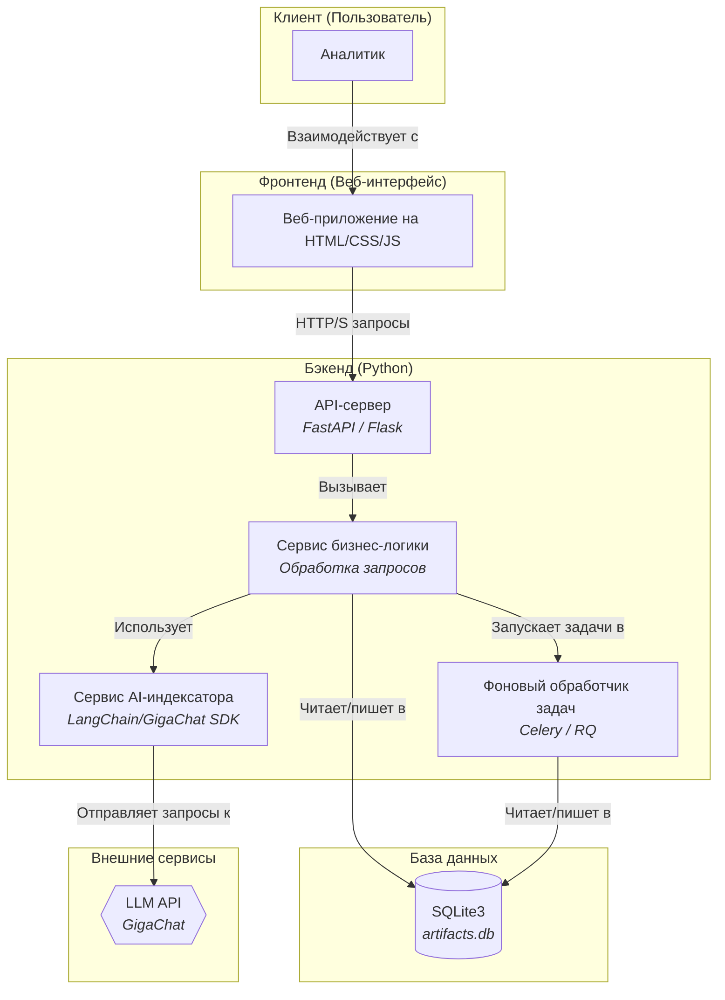

```mermaid
graph TD
    subgraph "Клиент (Пользователь)"
        A[Аналитик]
    end

    subgraph "Фронтенд (Веб-интерфейс)"
        B[Веб-приложение на HTML/CSS/JS]
    end

    subgraph "Бэкенд (Python)"
        C[API-сервер <br><i>FastAPI / Flask</i>]
        D[Сервис бизнес-логики <br><i>Обработка запросов</i>]
        E[Сервис AI-индексатора <br><i>LangChain/GigaChat SDK</i>]
        F[Фоновый обработчик задач <br><i>Celery / RQ</i>]
    end

    subgraph "База данных"
        G[(SQLite3 <br><i>artifacts.db</i>)]
    end
    
    subgraph "Внешние сервисы"
        H{{LLM API <br><i>GigaChat</i>}}
    end

    %% Связи между компонентами
    A -- Взаимодействует с --> B
    B -- HTTP/S запросы --> C
    C -- Вызывает --> D
    D -- Использует --> E
    D -- Запускает задачи в --> F
    D -- Читает/пишет в --> G
    F -- Читает/пишет в --> G
    E -- Отправляет запросы к --> H
```
