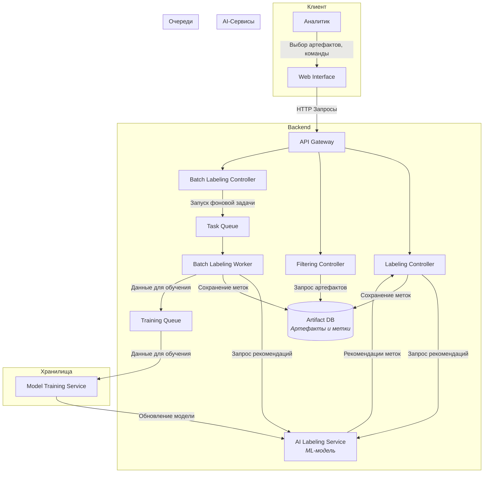

```mermaid
graph TD
    subgraph "Клиент"
        A[Аналитик] -->|Выбор артефактов, команды| B[Web Interface]
    end
    subgraph "Backend"
        B -->|HTTP Запросы| C[API Gateway]
        C --> D[Labeling Controller]
        C --> E[Filtering Controller]
        C --> F[Batch Labeling Controller]
        D -->|Запрос рекомендаций| G[AI Labeling Service]
        G -->|Рекомендации меток| D
        D -->|Сохранение меток| H[Artifact DB]
        E -->|Запрос артефактов| H
        F -->|Запуск фоновой задачи| I[Task Queue]
        I --> J[Batch Labeling Worker]
        J -->|Запрос рекомендаций| G
        J -->|Сохранение меток| H
        J -->|Данные для обучения| K[Training Queue]
    end
    subgraph "Хранилища"
        H[(Artifact DB <br/> <i>Артефакты и метки</i>)]
        K -->|Данные для обучения| L[Training Service]
        L -->|Обновление модели| G
    end
    subgraph "AI-Сервисы"
        G[AI Labeling Service <br/> <i>ML-модель</i>]
        L[Model Training Service]
    end
    subgraph "Очереди"
        I[Task Queue]
        K[Training Queue]
    end
```
