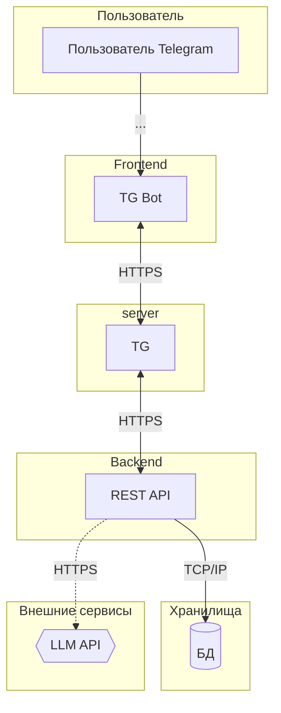

```mermaid
graph TD
    subgraph "Пользователь"
        A[Пользователь Telegram]
    end

    subgraph "Frontend"
        B[TG Bot]
    end
    
    subgraph "server"
        C[TG]
    end

    subgraph "Backend"
        D[REST API]
    end

    subgraph "Хранилища"
        E[(БД)]
    end

    subgraph "Внешние сервисы"
        F{{LLM API}}
    end

    %% Связи между компонентами
    A -- ... --> B
    B <-- HTTPS --> C
    C <-- HTTPS --> D
    D -- TCP/IP --> E
    D -. HTTPS .-> F
```
