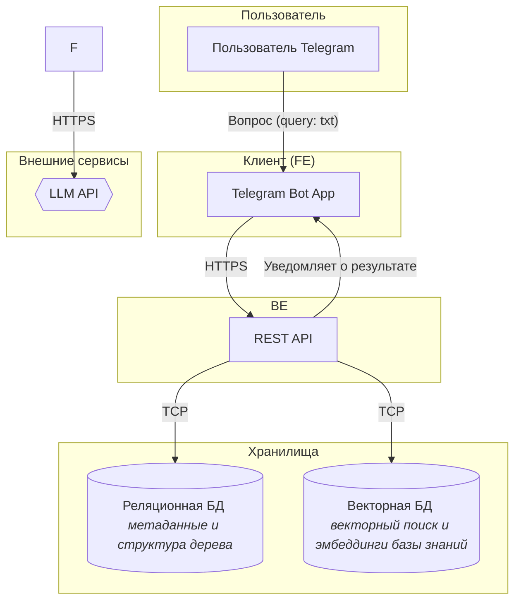

```mermaid
graph TD
    subgraph "Пользователь"
        A[Пользователь Telegram]
    end

    subgraph "Клиент (FE)"
        B[Telegram Bot App]
    end

    subgraph "BE"
        C[REST API]
    end

    subgraph "Хранилища"
        G[(Реляционная БД <br><i>метаданные и структура дерева</i>)]
        I[(Векторная БД <br><i>векторный поиск и эмбеддинги базы знаний</i>)]
    end

    subgraph "Внешние сервисы"
        H{{LLM API}}
    end

    %% Связи между компонентами
    A -- Вопрос (query: txt) --> B
    B -- HTTPS --> C
    F -- HTTPS --> H
    C -- TCP --> G
    C -- TCP --> I
    C -- Уведомляет о результате --> B
```
