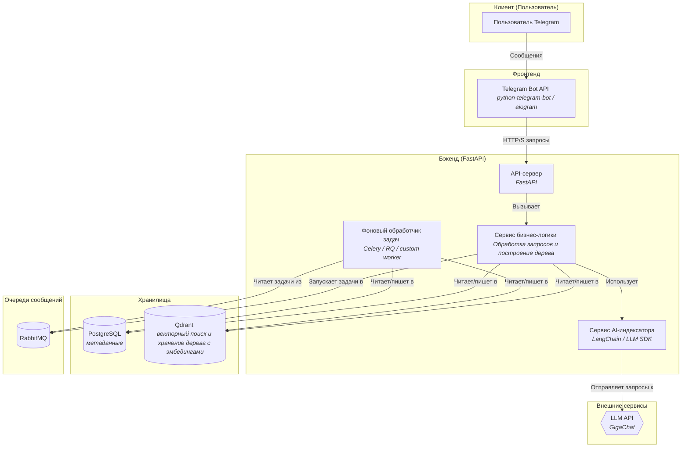

```mermaid
graph TD
    subgraph "Клиент (Пользователь)"
        A[Пользователь Telegram]
    end

    subgraph "Фронтенд"
        B[Telegram Bot API <br><i>python-telegram-bot / aiogram</i>]
    end

    subgraph "Бэкенд (FastAPI)"
        C[API-сервер <br><i>FastAPI</i>]
        D[Сервис бизнес-логики <br><i>Обработка запросов и построение дерева</i>]
        E[Сервис AI-индексатора <br><i>LangChain / LLM SDK</i>]
        F[Фоновый обработчик задач <br><i>Celery / RQ / custom worker</i>]
    end

    subgraph "Хранилища"
        G[(PostgreSQL <br><i>метаданные</i>)]
        I[(Qdrant <br><i>векторный поиск и хранение дерева с эмбедингами</i>)]
    end
    
    subgraph "Очереди сообщений"
        J[(RabbitMQ)]
    end

    subgraph "Внешние сервисы"
        H{{LLM API <br><i>GigaChat</i>}}
    end

    %% Связи между компонентами
    A -- Сообщения --> B
    B -- HTTP/S запросы --> C
    C -- Вызывает --> D
    D -- Использует --> E
    D -- Запускает задачи в --> J
    F -- Читает задачи из --> J
    D -- Читает/пишет в --> G
    D -- Читает/пишет в --> I
    F -- Читает/пишет в --> G
    F -- Читает/пишет в --> I
    E -- Отправляет запросы к --> H
```
