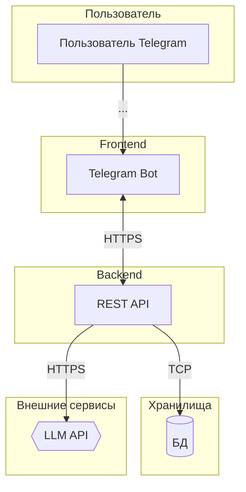

```mermaid
graph TD
    subgraph "Пользователь"
        A[Пользователь Telegram]
    end

    subgraph "Frontend"
        B[Telegram Bot]
    end

    subgraph "Backend"
        C[REST API]
    end

    subgraph "Хранилища"
        D[(БД)]
    end

    subgraph "Внешние сервисы"
        H{{LLM API}}
    end

    %% Связи между компонентами
    A -- ... --> B
    B <-- HTTPS --> C
    C -- HTTPS --> H
    C -- TCP --> D
```
