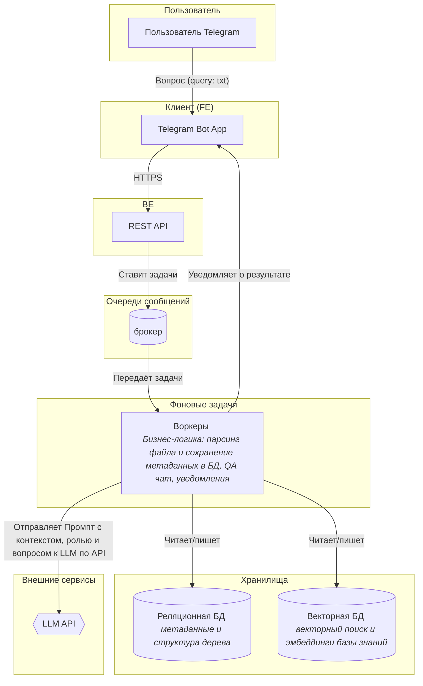

```mermaid
graph TD
    subgraph "Пользователь"
        A[Пользователь Telegram]
    end

    subgraph "Клиент (FE)"
        B[Telegram Bot App]
    end

    subgraph "BE"
        C[REST API]
    end

    subgraph "Очереди сообщений"
        J[(брокер)]
    end

    subgraph "Фоновые задачи"
        F[Воркеры <br><i>Бизнес-логика: парсинг файла и сохранение метаданных в БД, QA чат, уведомления</i>]
    end

    subgraph "Хранилища"
        G[(Реляционная БД <br><i>метаданные и структура дерева</i>)]
        I[(Векторная БД <br><i>векторный поиск и эмбеддинги базы знаний</i>)]
    end

    subgraph "Внешние сервисы"
        H{{LLM API}}
    end

    %% Связи между компонентами
    A -- Вопрос (query: txt) --> B
    B -- HTTPS --> C
    C -- Ставит задачи --> J
    J -- Передаёт задачи --> F
    F -- Отправляет Промпт с контекстом, ролью и вопросом к LLM по API --> H
    F -- Читает/пишет --> G
    F -- Читает/пишет --> I
    F -- Уведомляет о результате --> B
```
