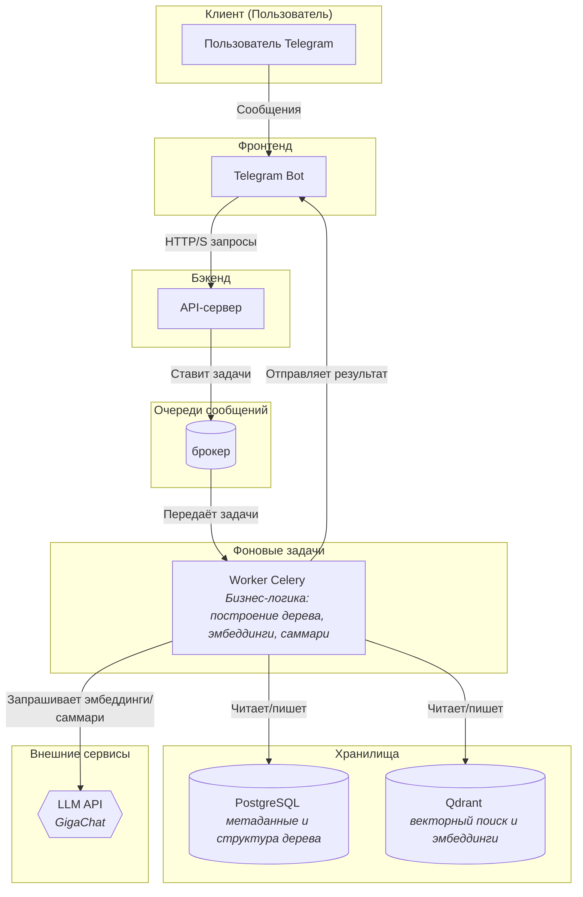

```mermaid
graph TD
    subgraph "Клиент (Пользователь)"
        A[Пользователь Telegram]
    end

    subgraph "Фронтенд"
        B[Telegram Bot]
    end

    subgraph "Бэкенд"
        C[API-сервер]
    end

    subgraph "Очереди сообщений"
        J[(брокер)]
    end

    subgraph "Фоновые задачи"
        F[Worker Celery <br><i>Бизнес-логика: построение дерева, эмбеддинги, саммари</i>]
    end

    subgraph "Хранилища"
        G[(PostgreSQL <br><i>метаданные и структура дерева</i>)]
        I[(Qdrant <br><i>векторный поиск и эмбеддинги</i>)]
    end

    subgraph "Внешние сервисы"
        H{{LLM API <br><i>GigaChat</i>}}
    end

    %% Связи между компонентами
    A -- Сообщения --> B
    B -- HTTP/S запросы --> C
    C -- Ставит задачи --> J
    J -- Передаёт задачи --> F
    F -- Запрашивает эмбеддинги/саммари --> H
    F -- Читает/пишет --> G
    F -- Читает/пишет --> I
    F -- Отправляет результат --> B
```
