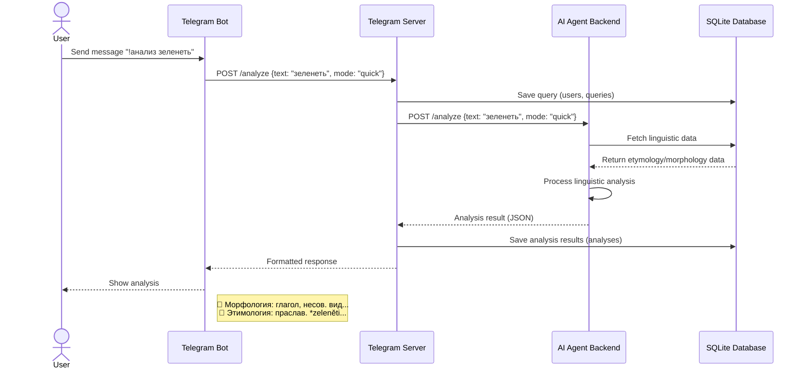

```mermaid
sequenceDiagram
    actor User
    participant Telegram Bot
    participant Telegram Server
    participant AI Agent Backend
    participant SQLite Database

    User->>Telegram Bot: Send message "!анализ зеленеть"
    Telegram Bot->>Telegram Server: POST /analyze {text: "зеленеть", mode: "quick"}
    Telegram Server->>SQLite Database: Save query (users, queries)
    Telegram Server->>AI Agent Backend: POST /analyze {text: "зеленеть", mode: "quick"}
    
    AI Agent Backend->>SQLite Database: Fetch linguistic data
    SQLite Database-->>AI Agent Backend: Return etymology/morphology data
    AI Agent Backend->>AI Agent Backend: Process linguistic analysis
    AI Agent Backend-->>Telegram Server: Analysis result (JSON)
    
    Telegram Server->>SQLite Database: Save analysis results (analyses)
    Telegram Server-->>Telegram Bot: Formatted response
    Telegram Bot-->>User: Show analysis
    Note right of Telegram Bot: 📌 Морфология: глагол, несов. вид...<br/>📖 Этимология: праслав. *zeleněti...
```
