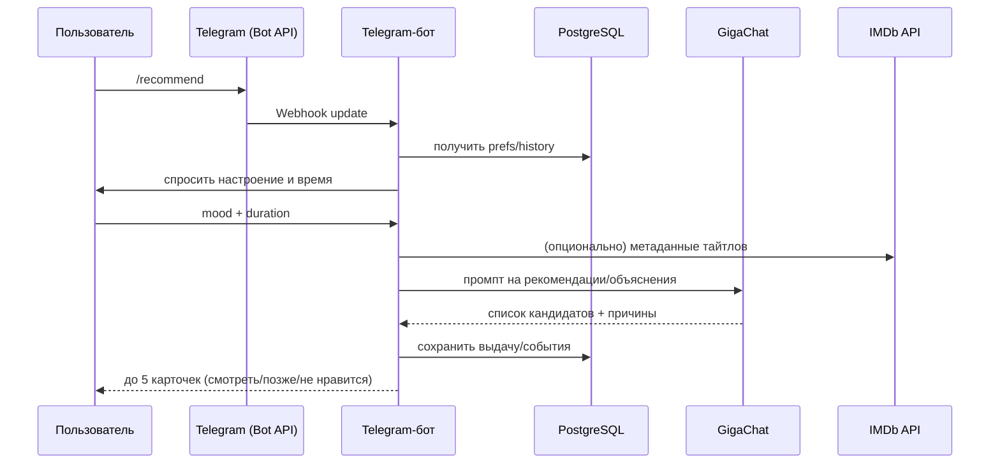

# Архитектура Telegram-бота (Киносоветник)

```mermaid
sequenceDiagram
    participant U as Пользователь
    participant T as Telegram (Bot API)
    participant B as Telegram-бот
    participant DB as PostgreSQL
    participant G as GigaChat
    participant I as IMDb API

    U->>T: /recommend
    T->>B: Webhook update
    B->>DB: получить prefs/history
    B->>U: спросить настроение и время
    U->>B: mood + duration
    B->>I: (опционально) метаданные тайтлов
    B->>G: промпт на рекомендации/объяснения
    G-->>B: список кандидатов + причины
    B->>DB: сохранить выдачу/события
    B-->>U: до 5 карточек (смотреть/позже/не нравится)
```
