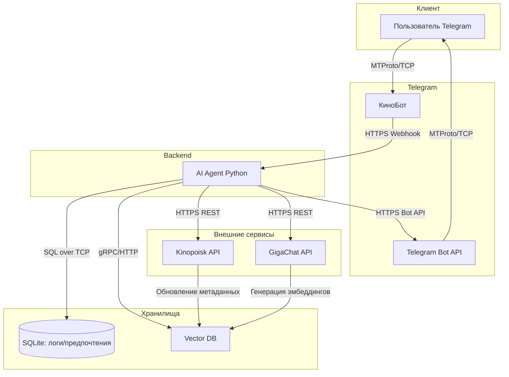

# Архитектура Telegram-бота (Киносоветник)

```mermaid
graph TD
    subgraph "Клиент"
        A[Пользователь Telegram]
    end
    
    subgraph "Telegram"
        B[КиноБот]
        I[Telegram Bot API]
    end
    
    subgraph "Backend"
        D[AI Agent Python]
    end
    
    subgraph "Хранилища"
        S[(SQLite: логи/предпочтения)]
        V[Vector DB]
    end
    
    subgraph "Внешние сервисы"
        K[Kinopoisk API]
        GC[GigaChat API]
    end

    A -- "MTProto/TCP" --> B
    B -- "HTTPS Webhook" --> D
    D -- "SQL over TCP" --> S
    D -- "gRPC/HTTP" --> V
    D -- "HTTPS REST" --> K
    D -- "HTTPS REST" --> GC
    D -- "HTTPS Bot API" --> I
    I -- "MTProto/TCP" --> A

    GC -- "Генерация эмбеддингов" --> V
    K -- "Обновление метаданных" --> V
```
