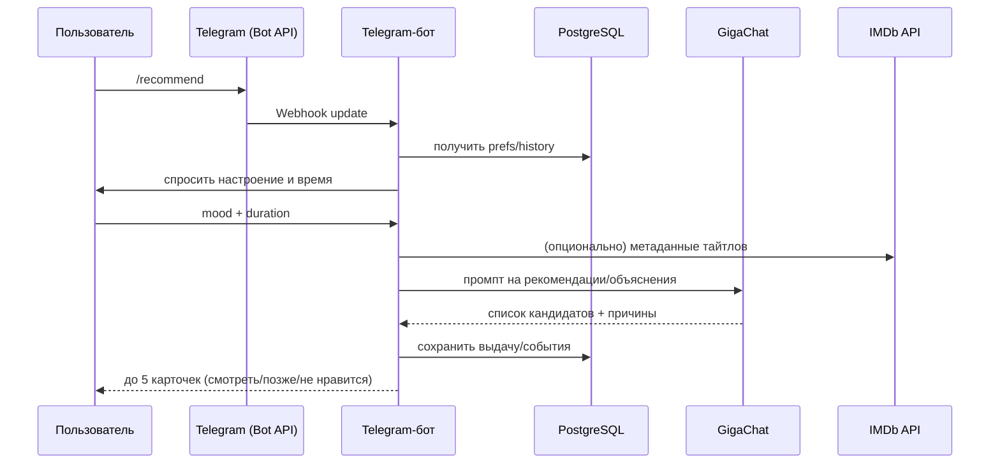

# Архитектура Telegram-бота (Киносоветник)

## Блок-схема архитектуры
```mermaid
flowchart LR
    U[Пользователь в Telegram] -->|MTProto| TG[Telegram]
    TG -->|Webhook HTTPS| BOT[Telegram-бот (Python/FastAPI/aiogram)]

    BOT -->|HTTPS| GIGA[AI GigaChat]
    BOT -->|SQL over TCP| PG[(PostgreSQL)]
    BOT -->|HTTPS| IMDB[IMDb API]

    PG ---|хранит| PREFS[Предпочтения/оценки/избранное]
    PG ---|хранит| TITLES[Каталог фильмов]
```

## Последовательность запроса /recommend

