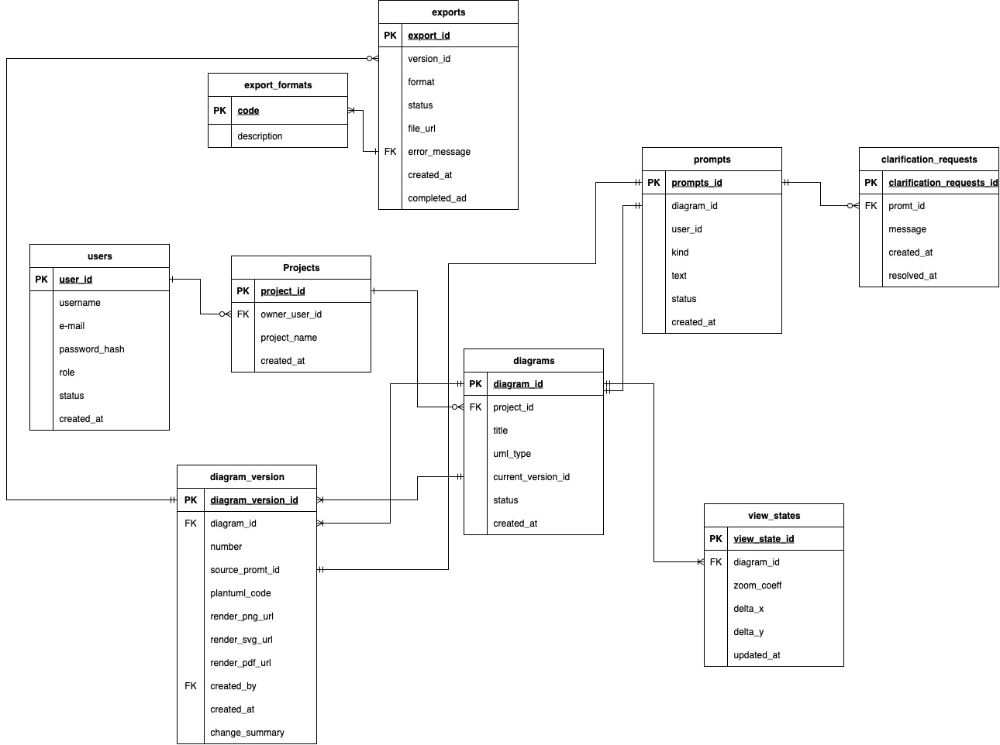

### Users

| Родительская сущность | Атрибут | Описание |
|---|---|---|
| Users | user_id (UUID, PK) | Уникальный идентификатор пользователя; ключ для связей с проектами, версиями, промптами, ViewState. |
| Users | username (string, UNIQUE) | Уникальное имя пользователя, заданное им при регистраци. |
| Users | email (string, UNIQUE) | Логин и контакт пользователя; используется для аутентификации и уведомлений. |
| Users | password_hash (string) | Хэш пароля для безопасной аутентификации. |
| Users | role (enum) | Роль доступа (user, admin); определяет разрешённые операции. |
| Users | status (enum) | Состояние учётной записи (active, blocked, deleted); влияет на вход в систему. |
| Users | created_at (datetime) | Дата/время создания пользователя (аудит). |

### Projects

| Родительская сущность | Атрибут | Описание |
|---|---|---|
| Projects | project_id (UUID, PK) | Уникальный идентификатор проекта. |
| Projects | owner_user_id (UUID, FK→User.id) | Владелец проекта; разграничение доступа. |
| Projects | project_name (string) | Название проекта (отображается в списках). |
| Projects | created_at (datetime) | Дата/время создания проекта (аудит). |

### Diagrams

| Родительская сущность | Атрибут | Описание |
|---|---|---|
| Diagrams | diagram_id (UUID, PK) | Уникальный идентификатор диаграммы. |
| Diagrams | project_id (UUID, FK→Project.id) | Принадлежность проекту. |
| Diagrams | title (string) | Заголовок диаграммы. |
| Diagrams | uml_type (enum) | Тип UML: usecase, sequence, class, activity, state, component и т. п. |
| Diagrams | current_version_id (UUID, FK→DiagramVersion.id, nullable) | Ссылка на активную версию. |
| Diagrams | status (enum) | Жизненный статус диаграммы (active, archived, deleted). |
| Diagrams | created_at (datetime) | Дата/время создания диаграммы. |

### Diagram_versions

| Родительская сущность | Атрибут | Описание |
|---|---|---|
| Diagram_versions | diagram_version_id (UUID, PK) | Уникальный идентификатор версии диаграммы. |
| Diagram_versions | diagram_id (UUID, FK→Diagram.id) | Связь с диаграммой. |
| Diagram_versions | number (int) | Порядковый номер версии (1, 2, 3…). |
| Diagram_versions | source_prompt_id (UUID, FK→Prompt.id, nullable) | Промпт, породивший эту версию. |
| Diagram_versions | plantuml_code (text) | Исходный PlantUML-код версии. |
| Diagram_versions | render_png_url (string) | Ссылка на PNG-рендер. |
| Diagram_versions | render_svg_url (string) | Ссылка на SVG-рендер. |
| Diagram_versions | render_pdf_url (string) | Ссылка на PDF-рендер. |
| Diagram_versions | created_by (UUID, FK→User.id) | Автор версии. |
| Diagram_versions | created_at (datetime) | Дата/время создания версии. |
| Diagram_versions | change_summary (string) | Краткое описание изменений. |

### Prompts

| Родительская сущность | Атрибут | Описание |
|---|---|---|
| Prompts | prompts_id (UUID, PK) | Уникальный идентификатор промпта. |
| Prompts | diagram_id (UUID, FK→Diagram.id) | К какой диаграмме относится. |
| Prompts | kind (enum: create, update, clarify) | Тип запроса. |
| Prompts | text (text) | Текстовое описание/инструкция. |
| Prompts | status (enum: processed, needs_clarification, failed) | Результат обработки. |
| Prompts | created_at (datetime) | Когда отправлен промпт. |

### Clarification_request

| Родительская сущность | Атрибут | Описание |
|---|---|---|
| Clarification_request | clarification_requests_id (UUID, PK) | Уникальный идентификатор запроса уточнения. |
| Clarification_request | prompt_id (UUID, FK→Prompt.id) | К какому промпту относится. |
| Clarification_request | message (string) | Текст запроса к пользователю. |
| Clarification_request | created_at (datetime) | Когда создан запрос. |

### Export_format

| Родительская сущность | Атрибут | Описание |
|---|---|---|
| Export_format | code (string, PK) | Код формата экспорта (PNG, SVG, PDF, PUML). |
| Export_format | description (string) | Название формата для UI. |

### Exports

| Родительская сущность | Атрибут | Описание |
|---|---|---|
| Exports | export_id (UUID, PK) | Уникальный идентификатор задачи экспорта. |
| Exports | version_id (UUID, FK→DiagramVersion.id) | Версия диаграммы для экспорта. |
| Exports | format (string, FK→ExportFormat.code) | Формат экспорта. |
| Exports | status (enum: queued, running, success, failed, no_space) | Состояние задачи. |
| Exports | file_url (string, nullable) | Ссылка на файл при успехе. |
| Exports | error_message (string, nullable) | Сообщение об ошибке. |
| Exports | created_at (datetime) | Когда задача создана. |
| Exports | completed_at (datetime, nullable) | Когда завершилась. |

### View_states

| Родительская сущность | Атрибут | Описание |
|---|---|---|
| View_states | view_states_id (UUID, PK) | Уникальный идентификатор состояния вида. |
| View_states | diagram_id (UUID, FK→Diagram.id) | К какой диаграмме относится. |
| View_states | zoom_coeff (float) | Текущий масштаб отображения. |
| View_states | delta_x (float) | Горизонтальный сдвиг. |
| View_states | delta_y (float) | Вертикальный сдвиг. |
| View_states | updated_at (datetime) | Когда сохранено последнее состояние. |

