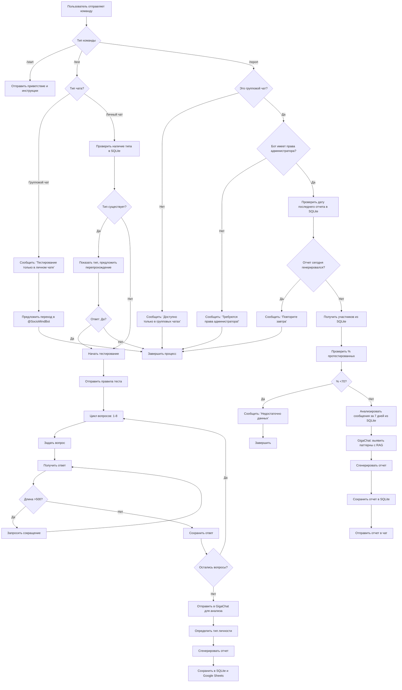

```mermaid
graph TD
    A[Пользователь отправляет команду] --> B{Тип команды}
    B -->|/start| C[Отправить приветствие и инструкции]
    B -->|/test| D{Тип чата?}
    B -->|/report| E{Это групповой чат?}
    
    %% /test branch 
    D -->|Групповой чат| D1[Сообщить: 'Тестирование только в личном чате']
    D1 --> D2[Предложить переход в @SocioMindBot] --> J[Завершить процесс]
    D -->|Личный чат| D3[Проверить наличие типа в SQLite]
    
    D3 --> F{Тип существует?}
    F -->|Да| G[Показать тип, предложить перепрохождение]
    G --> H{Ответ: Да?}
    H -->|Да| I[Начать тестирование]
    H -->|Нет| J[Завершить процесс]
    F -->|Нет| I
    
    I --> K[Отправить правила теста]
    K --> L[Цикл вопросов: 1-8]
    L --> M[Задать вопрос]
    M --> N[Получить ответ]
    N --> O{Длина >500?}
    O -->|Да| P[Запросить сокращение] --> N
    O -->|Нет| Q[Сохранить ответ]
    Q --> R{Остались вопросы?}
    R -->|Да| L
    R -->|Нет| S[Отправить в GigaChat для анализа]
    S --> T[Определить тип личности]
    T --> U[Сгенерировать отчет]
    U --> V[Сохранить в SQLite и Google Sheets]
    
    %% /report branch
    E -->|Нет| E1[Сообщить: 'Доступно только в групповых чатах'] --> J
    E -->|Да| E2{Бот имеет права администратора?}
    E2 -->|Нет| E3[Сообщить: 'Требуются права администратора!'] --> J
    E2 -->|Да| E4[Проверить дату последнего отчета в SQLite]
    E4 --> W{Отчет сегодня генерировался?}
    W -->|Да| X[Сообщить: 'Повторите завтра'] --> J
    W -->|Нет| Z[Получить участников из SQLite]
    Z --> AA[Проверить % протестированных]
    AA --> AB{% <70?}
    AB -->|Да| AC[Сообщить: 'Недостаточно данных'] --> AD[Завершить]
    AB -->|Нет| AE[Анализировать сообщения за 7 дней из SQLite]
    AE --> AF[GigaChat: выявить паттерны с RAG]
    AF --> AG[Сгенерировать отчет]
    AG --> AH[Сохранить отчет в SQLite]
    AH --> AI[Отправить отчет в чат]
    
```
