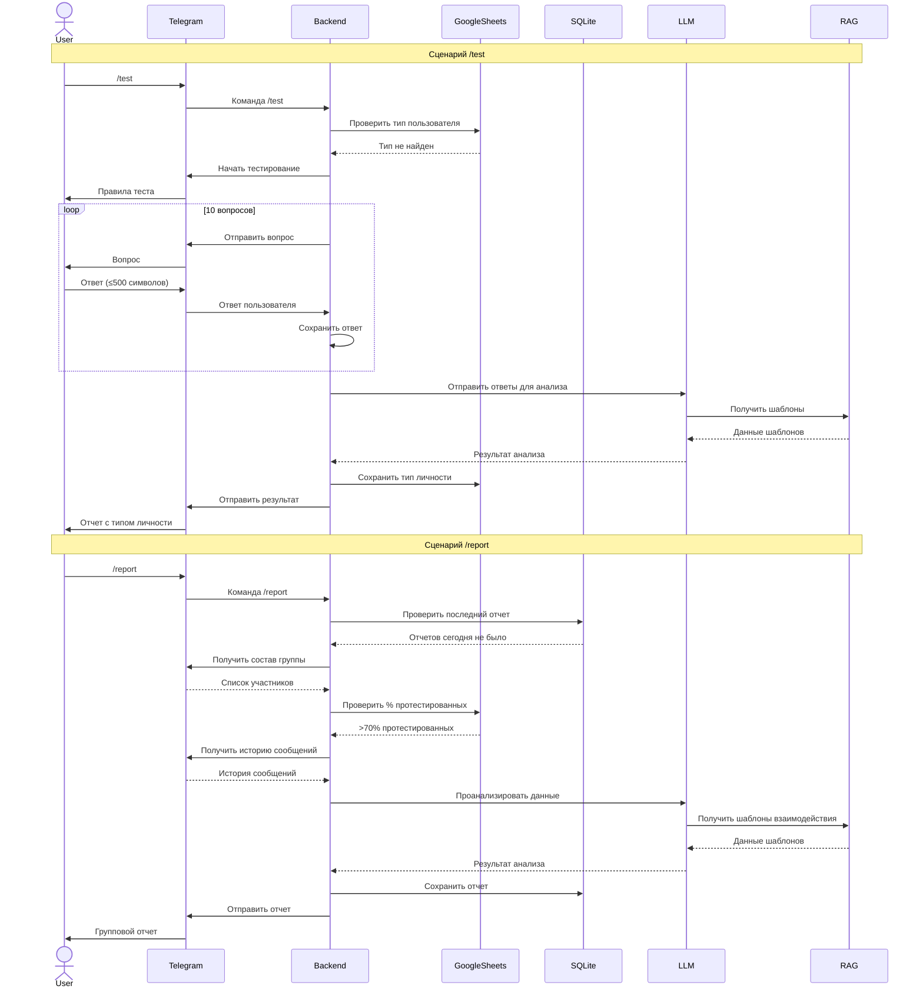

```mermaid
sequenceDiagram
    actor User
    participant Telegram
    participant Backend
    participant GoogleSheets
    participant SQLite
    participant LLM
    participant RAG

    Note over User, RAG: Сценарий /test
    User->>Telegram: /test
    Telegram->>Backend: Команда /test
    Backend->>GoogleSheets: Проверить тип пользователя
    GoogleSheets-->>Backend: Тип не найден
    Backend->>Telegram: Начать тестирование
    Telegram->>User: Правила теста
    
    loop 10 вопросов
        Backend->>Telegram: Отправить вопрос
        Telegram->>User: Вопрос
        User->>Telegram: Ответ (≤500 символов)
        Telegram->>Backend: Ответ пользователя
        Backend->>Backend: Сохранить ответ
    end
    
    Backend->>LLM: Отправить ответы для анализа
    LLM->>RAG: Получить шаблоны
    RAG-->>LLM: Данные шаблонов
    LLM-->>Backend: Результат анализа
    Backend->>GoogleSheets: Сохранить тип личности
    Backend->>Telegram: Отправить результат
    Telegram->>User: Отчет с типом личности

    Note over User, RAG: Сценарий /report
    User->>Telegram: /report
    Telegram->>Backend: Команда /report
    Backend->>SQLite: Проверить последний отчет
    SQLite-->>Backend: Отчетов сегодня не было
    Backend->>Telegram: Получить состав группы
    Telegram-->>Backend: Список участников
    Backend->>GoogleSheets: Проверить % протестированных
    GoogleSheets-->>Backend: >70% протестированных
    Backend->>Telegram: Получить историю сообщений 
    Telegram-->>Backend: История сообщений
    Backend->>LLM: Проанализировать данные
    LLM->>RAG: Получить шаблоны взаимодействия
    RAG-->>LLM: Данные шаблонов
    LLM-->>Backend: Результат анализа
    Backend->>SQLite: Сохранить отчет
    Backend->>Telegram: Отправить отчет
    Telegram->>User: Групповой отчет
```
