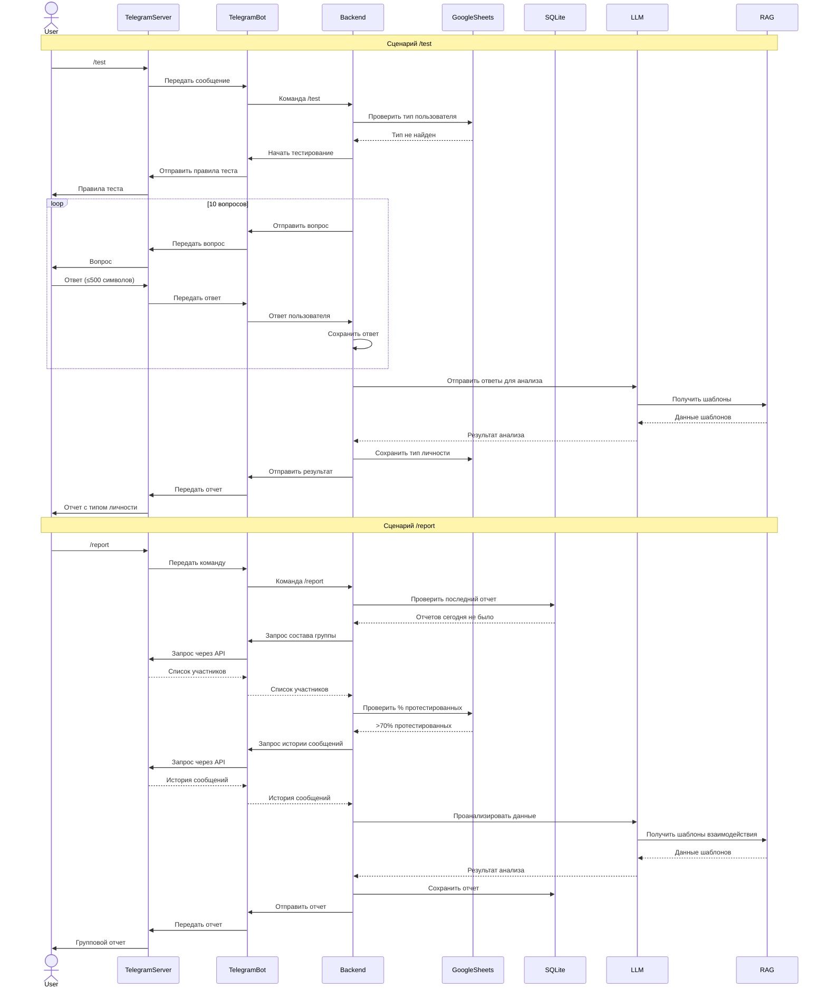

```mermaid
sequenceDiagram
    actor User
    participant TelegramServer
    participant TelegramBot
    participant Backend
    participant GoogleSheets
    participant SQLite
    participant LLM
    participant RAG

    Note over User, RAG: Cценарий /test
    User->>TelegramServer: /test
    TelegramServer->>TelegramBot: Передать сообщение
    TelegramBot->>Backend: Команда /test
    Backend->>GoogleSheets: Проверить тип пользователя
    GoogleSheets-->>Backend: Тип не найден
    Backend->>TelegramBot: Начать тестирование
    TelegramBot->>TelegramServer: Отправить правила теста
    TelegramServer->>User: Правила теста
    
    loop 10 вопросов
        Backend->>TelegramBot: Отправить вопрос
        TelegramBot->>TelegramServer: Передать вопрос
        TelegramServer->>User: Вопрос
        User->>TelegramServer: Ответ (≤500 символов)
        TelegramServer->>TelegramBot: Передать ответ
        TelegramBot->>Backend: Ответ пользователя
        Backend->>Backend: Сохранить ответ
    end
    
    Backend->>LLM: Отправить ответы для анализа
    LLM->>RAG: Получить шаблоны
    RAG-->>LLM: Данные шаблонов
    LLM-->>Backend: Результат анализа
    Backend->>GoogleSheets: Сохранить тип личности
    Backend->>TelegramBot: Отправить результат
    TelegramBot->>TelegramServer: Передать отчет
    TelegramServer->>User: Отчет с типом личности

    Note over User, RAG: Cценарий /report
    User->>TelegramServer: /report
    TelegramServer->>TelegramBot: Передать команду
    TelegramBot->>Backend: Команда /report
    Backend->>SQLite: Проверить последний отчет
    SQLite-->>Backend: Отчетов сегодня не было
    Backend->>TelegramBot: Запрос состава группы
    TelegramBot->>TelegramServer: Запрос через API
    TelegramServer-->>TelegramBot: Список участников
    TelegramBot-->>Backend: Список участников
    Backend->>GoogleSheets: Проверить % протестированных
    GoogleSheets-->>Backend: >70% протестированных
    Backend->>TelegramBot: Запрос истории сообщений
    TelegramBot->>TelegramServer: Запрос через API
    TelegramServer-->>TelegramBot: История сообщений
    TelegramBot-->>Backend: История сообщений
    Backend->>LLM: Проанализировать данные
    LLM->>RAG: Получить шаблоны взаимодействия
    RAG-->>LLM: Данные шаблонов
    LLM-->>Backend: Результат анализа
    Backend->>SQLite: Сохранить отчет
    Backend->>TelegramBot: Отправить отчет
    TelegramBot->>TelegramServer: Передать отчет
    TelegramServer->>User: Групповой отчет

```
