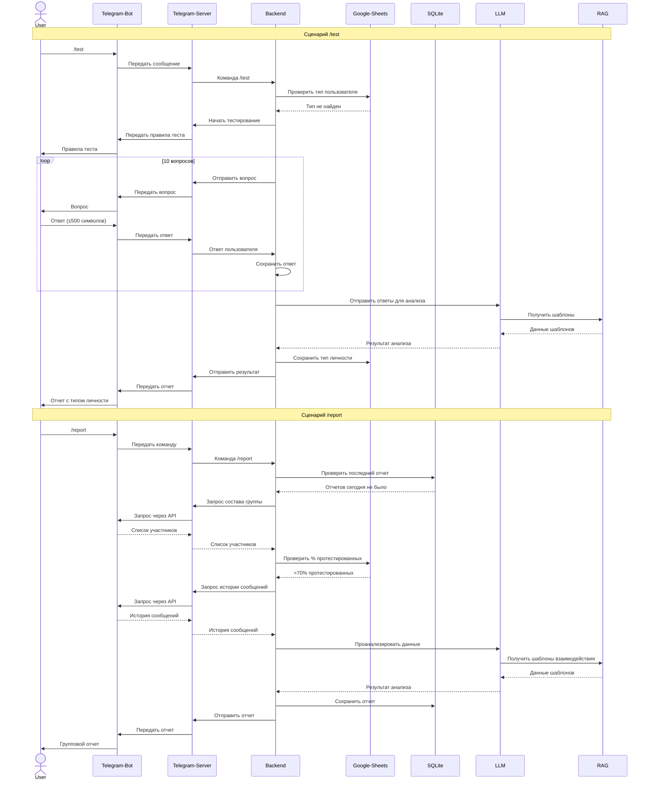

```mermaid
sequenceDiagram
    actor User
    participant Telegram-Bot
    participant Telegram-Server
    participant Backend
    participant Google-Sheets
    participant SQLite
    participant LLM
    participant RAG

    Note over User, RAG: Сценарий /test
    User->>Telegram-Bot: /test
    Telegram-Bot->>Telegram-Server: Передать сообщение
    Telegram-Server->>Backend: Команда /test
    Backend->>Google-Sheets: Проверить тип пользователя
    Google-Sheets-->>Backend: Тип не найден
    Backend->>Telegram-Server: Начать тестирование
    Telegram-Server->>Telegram-Bot: Передать правила теста
    Telegram-Bot->>User: Правила теста
    
    loop 10 вопросов
        Backend->>Telegram-Server: Отправить вопрос
        Telegram-Server->>Telegram-Bot: Передать вопрос
        Telegram-Bot->>User: Вопрос
        User->>Telegram-Bot: Ответ (≤500 символов)
        Telegram-Bot->>Telegram-Server: Передать ответ
        Telegram-Server->>Backend: Ответ пользователя
        Backend->>Backend: Сохранить ответ
    end
    
    Backend->>LLM: Отправить ответы для анализа
    LLM->>RAG: Получить шаблоны
    RAG-->>LLM: Данные шаблонов
    LLM-->>Backend: Результат анализа
    Backend->>Google-Sheets: Сохранить тип личности
    Backend->>Telegram-Server: Отправить результат
    Telegram-Server->>Telegram-Bot: Передать отчет
    Telegram-Bot->>User: Отчет с типом личности

    Note over User, RAG: Сценарий /report
    User->>Telegram-Bot: /report
    Telegram-Bot->>Telegram-Server: Передать команду
    Telegram-Server->>Backend: Команда /report
    Backend->>SQLite: Проверить последний отчет
    SQLite-->>Backend: Отчетов сегодня не было
    Backend->>Telegram-Server: Запрос состава группы
    Telegram-Server->>Telegram-Bot: Запрос через API
    Telegram-Bot-->>Telegram-Server: Список участников
    Telegram-Server-->>Backend: Список участников
    Backend->>Google-Sheets: Проверить % протестированных
    Google-Sheets-->>Backend: >70% протестированных
    Backend->>Telegram-Server: Запрос истории сообщений
    Telegram-Server->>Telegram-Bot: Запрос через API
    Telegram-Bot-->>Telegram-Server: История сообщений
    Telegram-Server-->>Backend: История сообщений
    Backend->>LLM: Проанализировать данные
    LLM->>RAG: Получить шаблоны взаимодействия
    RAG-->>LLM: Данные шаблонов
    LLM-->>Backend: Результат анализа
    Backend->>SQLite: Сохранить отчет
    Backend->>Telegram-Server: Отправить отчет
    Telegram-Server->>Telegram-Bot: Передать отчет
    Telegram-Bot->>User: Групповой отчет

```
