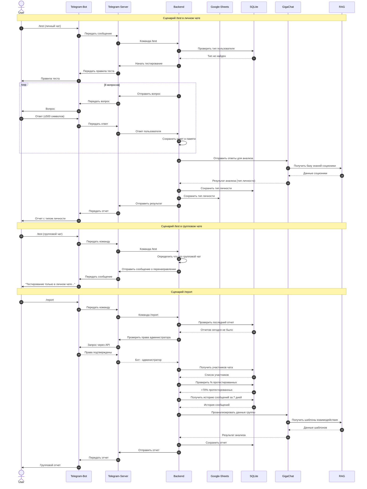

```mermaid
sequenceDiagram
    autonumber
    actor User
    participant Telegram-Bot
    participant Telegram-Server
    participant Backend
    participant Google-Sheets
    participant SQLite
    participant GigaChat
    participant RAG

    Note over User, RAG: Сценарий /test в личном чате
    User->>Telegram-Bot: /test (личный чат)
    Telegram-Bot->>Telegram-Server: Передать сообщение
    Telegram-Server->>Backend: Команда /test
    Backend->>SQLite: Проверить тип пользователя
    SQLite-->>Backend: Тип не найден
    Backend->>Telegram-Server: Начать тестирование
    Telegram-Server->>Telegram-Bot: Передать правила теста
    Telegram-Bot->>User: Правила теста
    
    loop 8 вопросов
        Backend->>Telegram-Server: Отправить вопрос
        Telegram-Server->>Telegram-Bot: Передать вопрос
        Telegram-Bot->>User: Вопрос
        User->>Telegram-Bot: Ответ (≤500 символов)
        Telegram-Bot->>Telegram-Server: Передать ответ
        Telegram-Server->>Backend: Ответ пользователя
        Backend->>Backend: Сохранить ответ в памяти
    end
    
    Backend->>GigaChat: Отправить ответы для анализа
    GigaChat->>RAG: Получить базу знаний соционики
    RAG-->>GigaChat: Данные соционики
    GigaChat-->>Backend: Результат анализа (тип личности)
    Backend->>SQLite: Сохранить тип личности
    Backend->>Google-Sheets: Сохранить тип личности
    Backend->>Telegram-Server: Отправить результат
    Telegram-Server->>Telegram-Bot: Передать отчет
    Telegram-Bot->>User: Отчет с типом личности

    Note over User, RAG: Сценарий /test в групповом чате
    User->>Telegram-Bot: /test (групповой чат)
    Telegram-Bot->>Telegram-Server: Передать команду
    Telegram-Server->>Backend: Команда /test
    Backend->>Backend: Определить что это групповой чат
    Backend->>Telegram-Server: Отправить сообщение о перенаправлении
    Telegram-Server->>Telegram-Bot: Передать сообщение
    Telegram-Bot->>User: "Тестирование только в личном чате..."

    Note over User, RAG: Сценарий /report
    User->>Telegram-Bot: /report
    Telegram-Bot->>Telegram-Server: Передать команду
    Telegram-Server->>Backend: Команда /report
    Backend->>SQLite: Проверить последний отчет
    SQLite-->>Backend: Отчетов сегодня не было
    Backend->>Telegram-Server: Проверить права администратора
    Telegram-Server->>Telegram-Bot: Запрос через API
    Telegram-Bot-->>Telegram-Server: Права подтверждены
    Telegram-Server-->>Backend: Бот - администратор
    Backend->>SQLite: Получить участников чата
    SQLite-->>Backend: Список участников
    Backend->>SQLite: Проверить % протестированных
    SQLite-->>Backend: >70% протестированных
    Backend->>SQLite: Получить историю сообщений за 7 дней
    SQLite-->>Backend: История сообщений
    Backend->>GigaChat: Проанализировать данные группы
    GigaChat->>RAG: Получить шаблоны взаимодействия
    RAG-->>GigaChat: Данные шаблонов
    GigaChat-->>Backend: Результат анализа
    Backend->>SQLite: Сохранить отчет
    Backend->>Telegram-Server: Отправить отчет
    Telegram-Server->>Telegram-Bot: Передать отчет
    Telegram-Bot->>User: Групповой отчет

```
