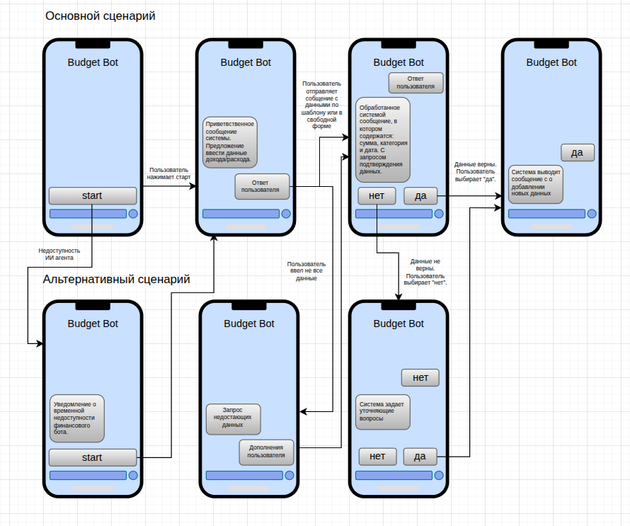
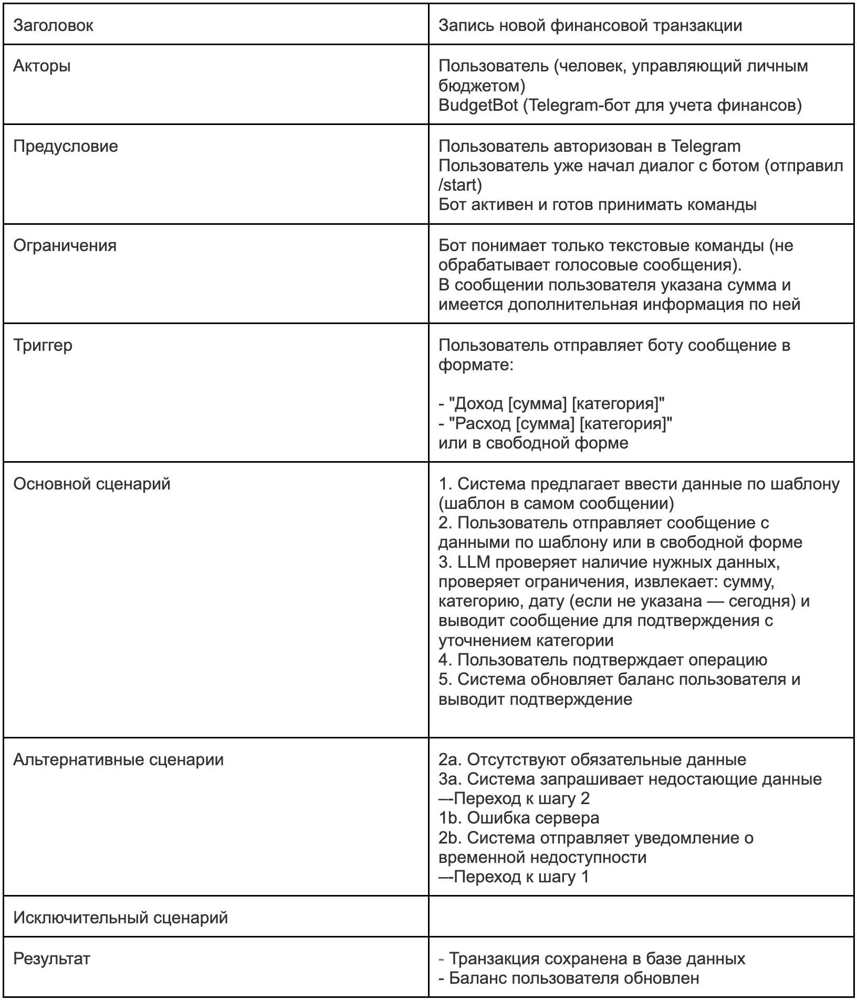
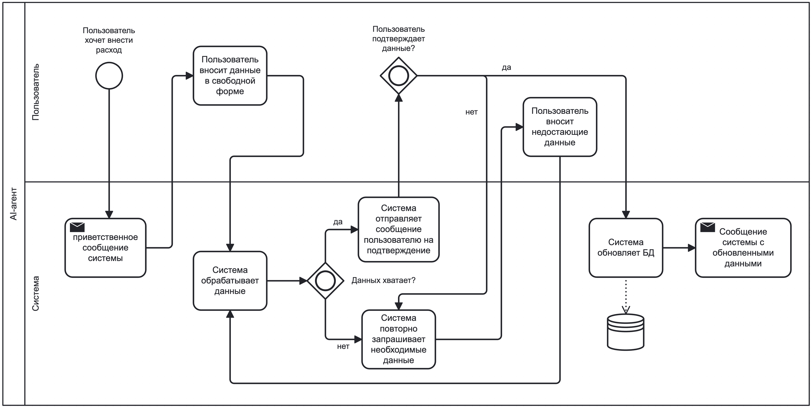

#### 1. BudgetBot

AI Агент: "BudgetBot" – Телеграм-бот для учета личных финансов

---
#### 2. User Story  

User Story:  

Как пользователь, который хочет контролировать свои финансы я хочу вносить свои доходы и расходы в свободной форме чтобы иметь историю операций, а также получать рекомендации исходя из статистики расходов

---
#### 3. Макеты

---
#### 4. Use Case: Запись новой финансовой транзакции

---
#### 5. BPMN
